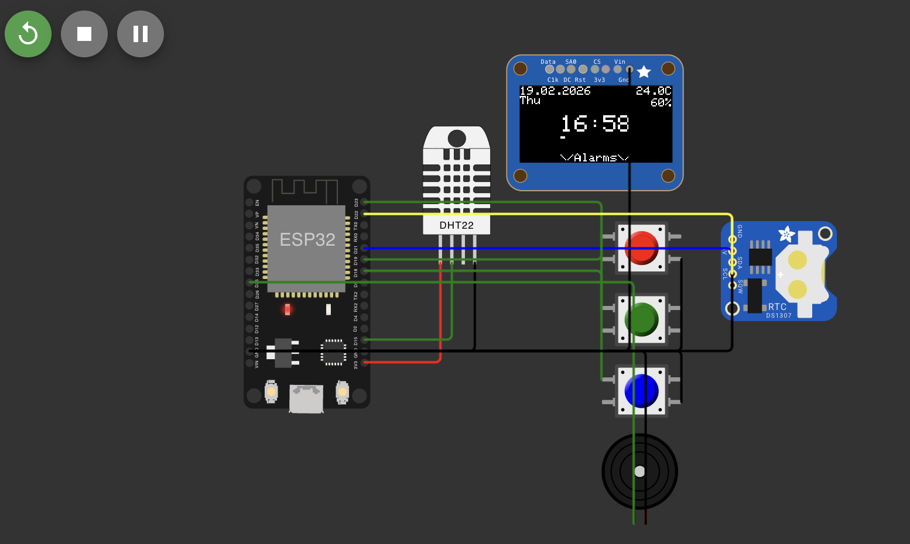

# ESP32 Module

ESP32 project displaying real-time clock, temperature, and humidity on a 128×64 OLED screen. 
Built with FreeRTOS tasks and a custom thread-safe data wrapper.
Used Wokwi and PlatformIO for simulation.


## Hardware

| Component | Pin |
|-----------|-----|
| SSD1306 OLED (128×64) | SDA: D21, SCL: D22 |
| DS1307 RTC | SDA: D21, SCL: D22 |
| DHT22 temperature/humidity sensor | SDA: D15 |
| Buzzer | D25 |
| Buttons (3) | D18, D19, D21 |

## Features

- Real-time clock display (HH:MM) with seconds bar, date, day of week
- Temperature and humidity monitoring
- Heap usage monitor (for debug version)
- Thread-safe sensor reads via custom `core::locked<T>` mutex wrapper
- Release and debug configurations

## FreeRTOS Tasks

| Task | Stack | Priority | Period |
|------|-------|----------|--------|
| `SENSOR_TASK` | 2048 B | 1 | 5000 ms |
| `RENDER_TASK` | 8192 B | 1 | 60 ms |
| `BUTTON_TASK` | 2048 B | 2 | 50 ms |

## Resource Usage

```
RAM:   [=         ]   6.7% (used 22096 bytes from 327680 bytes)
Flash: [==        ]  24.0% (used 315013 bytes from 1310720 bytes)
```

## Todo
- ~~Render current date on the display~~
- Implement mini-interface with multiple buttons for simple control
- Add alarms module
- ~~Protect `was_pressed` with `core::locked<T>`~~
- Update time over WIFI
